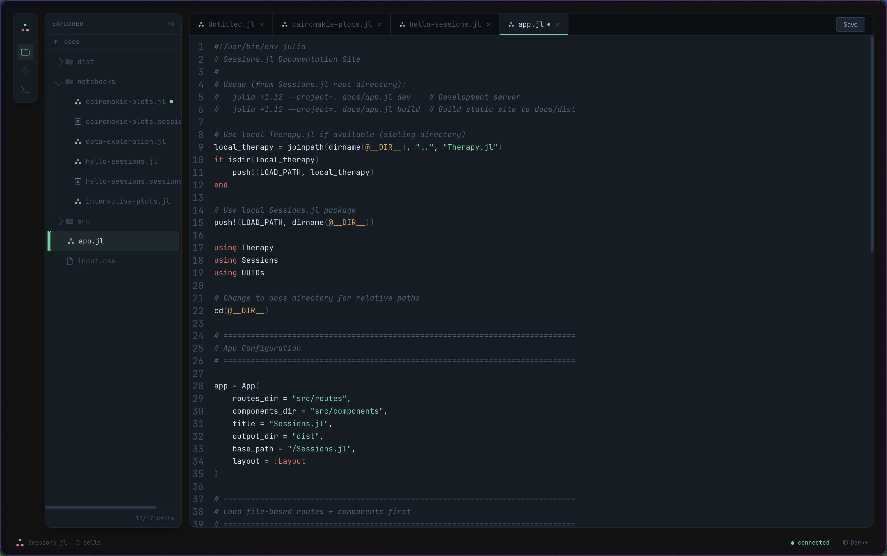
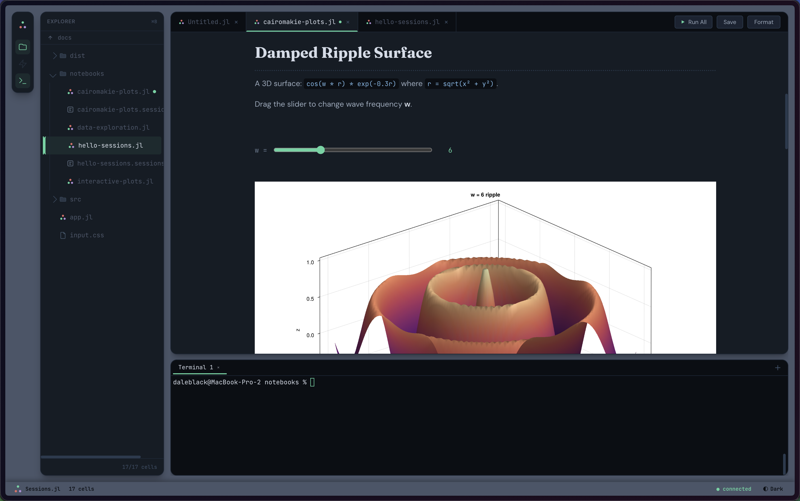

<div align="center">
  

  **A reactive Julia notebook IDE.**

  [](https://grouptherapyorg.github.io/Sessions.jl/)
  [](LICENSE.md)
</div>

---


---

> **Warning: Experimental, alpha-quality software.** Untested outside its own test suite. Rough edges everywhere. Everything is subject to breaking changes. If you need a reliable reactive notebook today, use [Pluto.jl](https://github.com/fonsp/Pluto.jl). This exists to explore ideas at the intersection of reactive notebooks, file-based collaboration, and one-click interactive publishing.

---





---

## What is Sessions.jl?

Sessions.jl is a reactive Julia notebook that runs in your browser as a local web IDE. It is designed around **plain `.jl` files that anyone can edit** — you in the browser, an AI assistant from the terminal, or a script in CI. A file watcher picks up all changes and the UI updates live.

**Key ideas:**

- **File-based collaboration.** The notebook is a plain `.jl` file. Edit in the browser, from the terminal, or programmatically. Changes from any source appear in real time via file watching.
- **Code/state separation.** Pure code lives in `.jl`, cached outputs in `.sessions.toml`. External edits never corrupt your execution state. Delete the cache anytime; re-run to regenerate.
- **Full IDE in the browser.** CodeMirror editor with Julia syntax highlighting, Shoelace file explorer with lazy loading, xterm.js terminal with real PTY shell. Everything in one window.
- **Pluto-compatible.** Same `.jl` file format, same reactivity engine (ExpressionExplorer + PlutoDependencyExplorer). Open the same file in Pluto or Sessions.
- **One-click interactive publishing.** Export notebooks as static HTML with interactive `@bind` widgets compiled to JavaScript. No Julia server needed. Host on GitHub Pages, Netlify, anywhere.

## One-Click Publish Architecture

Sessions.jl publishes notebooks as [Therapy.jl](https://github.com/GroupTherapyOrg/Therapy.jl) apps. Each notebook becomes a single `@island` component with the full reactive graph compiled to JavaScript via [JavaScriptTarget.jl](https://github.com/GroupTherapyOrg/JavaScriptTarget.jl).

```
┌─────────────────────────────────────────────────────┐
│                  Published Notebook                  │
│                                                     │
│  ┌─ Cell 1 (markdown) ─────────────────────── SSR ─┐│
│  │  # Analysis Title                               ││
│  │  Some prose explaining the work.                 ││
│  └──────────────────────────────────────────────────┘│
│                                                     │
│  ┌─ Cell 2 (setup, folded) ────── server-hidden ───┐│
│  │  using Statistics;  # code NOT in DOM            ││
│  └──────────────────────────────────────────────────┘│
│                                                     │
│  ┌─ Cell 3 (@bind) ──────────────── @island ───────┐│
│  │  @bind freq Slider(1:20)                         ││
│  │  ┌──────────────────────┐                        ││
│  │  │ ●━━━━━━━━━○━━━━━━━━━│  7                     ││
│  │  └──────────────────────┘                        ││
│  ├─ Cell 4 (depends on freq) ──── compiled to JS ──┤│
│  │  output: sin wave plot (reactive)                ││
│  │  code: plot(sin.(x .* freq))  [eye toggle]       ││
│  ├─ Cell 5 (static) ──────────── cached output ────┤│
│  │  output: "CSV written: 1,200 rows"  [static]     ││
│  │  code: CSV.write("out.csv", df)  [not compilable]││
│  └──────────────────────────────────────────────────┘│
└─────────────────────────────────────────────────────┘
```

**How it works:**

1. **Default: every cell is static HTML.** Markdown renders to HTML. DataFrames render to styled tables. Plots render to Plotly JSON. Code outputs render as preformatted text. Zero JS.

2. **`@bind` cells and their dependents get compiled to JS.** Sessions knows the reactive dependency graph. When it sees `@bind freq Slider(1:20)`, it traces downstream: "which cells read `freq`?" Those cells get compiled to JavaScript via JST and wrapped in a Therapy `@island`.

3. **Graceful fallback for non-compilable cells.** If a dependent cell uses Julia features JST can't transpile (file I/O, unregistered packages), it stays static with cached output and a diagnostic badge explaining why.

**Three cell visibility modes in published notebooks:**

| Mode | What renders | How |
|------|-------------|-----|
| **Toggleable** (default) | Output + code with eye icon | `Show()` + `create_signal` — reader can hide/show |
| **Server-hidden** (`folded=true`) | Output only, code not in DOM | Code omitted at build time — truly protected |
| **Suppressed** (ends with `;`) | No output shown | Standard Julia semantics |

**Reactive primitives** (all from [Therapy.jl](https://github.com/GroupTherapyOrg/Therapy.jl), inspired by [SolidJS](https://solidjs.com)):

| Primitive | Purpose |
|-----------|---------|
| `create_signal(initial)` | Reactive state — `@bind` widget values |
| `create_memo(() -> ...)` | Derived computation — dependent cells |
| `create_effect(() -> ...)` | Side effects — plot rendering, console logging |
| `on_mount(() -> ...)` | One-time initialization after hydration |
| `Show(signal) do ... end` | Conditional rendering — code visibility toggle |
| `batch(() -> ...)` | Coalesce multiple signal updates |
| `For(items) do ... end` | Reactive list rendering |

**One architecture for both modes:**

| | Live IDE | Published Notebook |
|---|---------|-------------------|
| **Structure** | One `@island` per notebook | Same |
| **Reactivity** | Server-side Julia + WebSocket | Client-side JS (compiled by JST) |
| **`@bind` sliders** | Signal → WS → server eval → WS → output | Signal → JS effect → output |
| **Eye toggles** | Per-cell `Show()` + signal | Same |
| **Cell gaps** | `+ Code` buttons (add cells) | Static dividers |

## Installation

Requires Julia 1.12+.

```julia
using Pkg
Pkg.Apps.add(url="https://github.com/GroupTherapyOrg/Sessions.jl")
```

This installs the `sessions` command to `~/.julia/bin/`.

## Quick Start

```bash
# Open a notebook in the web IDE
sessions my_notebook.jl

# Start in a project directory (file explorer shows that directory)
cd my_project/ && sessions

# Run headlessly (CI, scripts, automation)
sessions run my_notebook.jl
```

The web IDE opens at `http://127.0.0.1:8080`.

Or from a Julia session:

```julia
using Sessions
Sessions.main(["my_notebook.jl"])
```

## Architecture

### Component Tree

```
Layout (SSR — HTML shell, CSS, theme init, script tags)
├── StatusBar (@island — theme toggle, connection status, cell count)
├── ActivityBar (@island — sidebar/terminal toggles via shared signals)
├── FileExplorer (@island — Shoelace tree, WS file operations)
├── NotebookPanel (@island — tabs, toolbar: Run All / Save / Format)
│   ├── Notebook (@island, nested — THE PUBLISHABLE UNIT)
│   │   └── cells, eye toggles, @bind widgets, outputs, all signals
│   └── FileEditor (@island, nested — CodeMirror for non-notebook files)
└── Terminal (@island — xterm.js, PTY bridge, multi-tab)
```

**Key: Notebook is its own @island** so the export pipeline can extract it standalone.
In live IDE mode it receives cell outputs via WebSocket. In published mode,
@bind signals drive JST-compiled dependent cells — same component, two modes.

### Theme System

All colors defined in one file: `src/web/theme.css`. Every component references
CSS custom properties — never hardcoded hex values. Change a color once,
the entire IDE updates.

```css
:root {                              /* Light mode */
  --workspace-bg: #f8f7f4;          /* warm-50 */
  --panel-bg: #ffffff;
  --cell-bg: #f8f7f4;               /* = workspace */
  --accent: #d4759a;                /* rose */
  --status-done: #56d4a0;           /* green */
  --status-error: #dc3545;          /* red */
}
.dark {                              /* Dark mode */
  --workspace-bg: #1a2332;
  --panel-bg: #0f1419;
  --cell-bg: #1a2332;               /* = workspace */
  --chrome-bg: #050709;             /* near-black (tabs, terminal) */
}
```

### File Structure

```
Sessions.jl/
├── src/
│   ├── Sessions.jl          # Core module
│   ├── types.jl             # Cell, Notebook, CellOutput
│   ├── format.jl            # .jl notebook parser/serializer (Pluto-compatible)
│   ├── analysis.jl          # Reactive dependency analysis
│   ├── kernel.jl            # Cell execution engine
│   ├── session.jl           # .sessions.toml cache read/write
│   ├── formatting.jl        # Runic.jl formatter (isolated subprocess)
│   ├── pty.jl               # PTY management (terminal subprocess)
│   ├── terminal_server.jl   # xterm.js to PTY WebSocket bridge
│   ├── web_server.jl        # WebSocket channel handlers
│   ├── web/                 # Web UI (Therapy.jl app)
│   │   ├── app.jl           # Web app entry point
│   │   ├── theme.css        # Single source of truth for all colors
│   │   └── src/components/  # Layout, NotebookPanel, Notebook, Terminal, etc.
│   └── worker/              # Malt.jl notebook workers (isolated execution)
├── SessionsUI/              # Lightweight notebook API (zero heavy deps)
│   └── src/
│       ├── SessionsUI.jl
│       └── widgets.jl       # @bind, Slider, Bond, etc.
└── test/
```

### Two Packages, One Repo

| Package | Purpose | Deps | How to use |
|---------|---------|------|-----------|
| **Sessions.jl** | The IDE app | Therapy.jl, Malt.jl, HTTP... | `Pkg.Apps.add(url=...)` |
| **SessionsUI** | Notebook API for `@bind` | UUIDs only (stdlib) | `using SessionsUI: @bind, BoundSlider` |

SessionsUI is what notebook code imports. It has zero heavy dependencies and compiles in ~300ms. Sessions.jl (the app) depends on SessionsUI, not the other way around.

## Code/State Separation

Sessions.jl splits your notebook into two files:

| File | Contains | Role |
|------|----------|------|
| `notebook.jl` | Cell code, cell order, fold/disabled metadata | **Source of truth** — editable from anywhere |
| `notebook.sessions.toml` | Cached outputs, stdout, runtime, errors | **Execution cache**, optional, deletable, auto-regenerated |

Anyone can freely edit the `.jl` file — the browser IDE, an external editor, or a script. The file watcher detects changes within a second, marks modified cells as stale, and the UI shows what needs re-execution.

## @bind Widgets

```julia
using SessionsUI: @bind, BoundSlider, BoundCheckBox, BoundTextField, BoundSelect

@bind x BoundSlider(1:100)
@bind name BoundTextField(default="world")
@bind flag BoundCheckBox()
@bind choice BoundSelect(["A", "B", "C"])
```

## Built On

- [Therapy.jl](https://github.com/GroupTherapyOrg/Therapy.jl) — signals-based web framework, inspired by [SolidJS](https://solidjs.com) (signals) and [Astro](https://astro.build) (islands)
- [JavaScriptTarget.jl](https://github.com/GroupTherapyOrg/JavaScriptTarget.jl) — Julia-to-JavaScript transpiler for `@bind` interactivity
- [Pluto.jl](https://github.com/fonsp/Pluto.jl) file format and reactive engine ([ExpressionExplorer.jl](https://github.com/JuliaPluto/ExpressionExplorer.jl), [PlutoDependencyExplorer.jl](https://github.com/JuliaPluto/PlutoDependencyExplorer.jl))
- [Malt.jl](https://github.com/JuliaPluto/Malt.jl) isolated worker processes
- [Runic.jl](https://github.com/fredrikekre/Runic.jl) code formatter
- [CodeMirror](https://codemirror.net/) code editor
- [Shoelace](https://shoelace.style/) web components (file explorer)
- [xterm.js](https://xtermjs.org/) terminal emulator

## License

MIT
