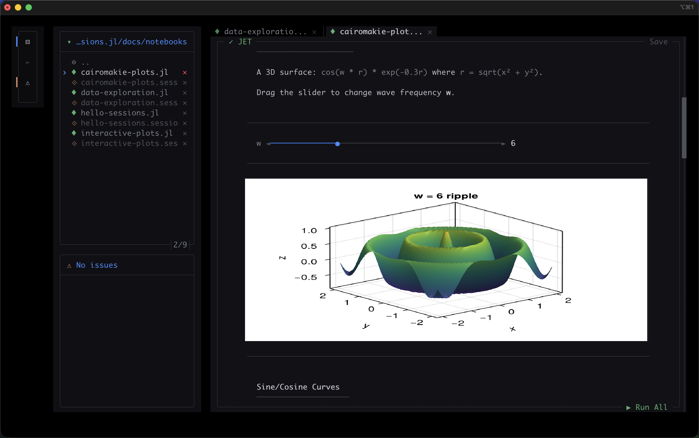
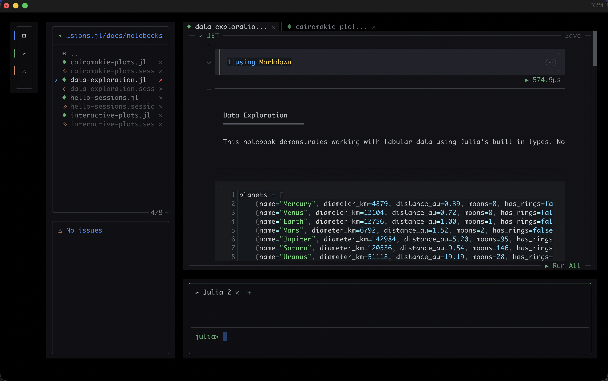

# Sessions.jl

<div align="center">
  <picture>
    <source media="(prefers-color-scheme: dark)" srcset="assets/sessions_dark.svg">
    <source media="(prefers-color-scheme: light)" srcset="assets/sessions_light.svg">
    
  </picture>

  **A terminal-native reactive Julia notebook built on [Pluto.jl](https://github.com/fonsp/Pluto.jl)'s reactive engine and [Tachikoma.jl](https://github.com/kahliburke/Tachikoma.jl).**

  [](https://grouptherapyorg.github.io/Sessions.jl/)
  [](LICENSE.md)
</div>

---

> **Warning: This is an experimental, alpha-quality project.** It is largely untested outside of its own test suite, has rough edges everywhere, and may never reach the goals described below. If you need a reliable reactive notebook today, use [Pluto.jl](https://github.com/fonsp/Pluto.jl) -- it's excellent. This exists because building it is fun and the ideas are worth exploring.

<div align="center">
  
  <br><br>
  
</div>

## Why This Exists

Over the past couple of months I've been shifting more and more toward agent-driven development -- LLMs writing code, running tests, iterating in the terminal. The terminal has become the center of my workflow, but I miss Pluto deeply. Pluto's reactive model is one of the best ideas in scientific computing, and I wanted it in my terminal.

The problem is that Pluto (understandably) isn't optimized for agents editing notebook files externally. The `.jl` file interleaves code with package state and metadata, so an LLM modifying cells risks corrupting that state. Sessions.jl splits the notebook into two files -- pure code in `.jl`, cached outputs in `.session.toml` -- so agents, scripts, and editors can freely modify cells without breaking anything.

I've also missed Pluto in cluster and HPC environments -- headless servers where you SSH in and there's no browser to speak of. A terminal-native notebook that works over a plain SSH session could make reactive notebooks accessible in places they currently aren't. Whether Sessions.jl actually gets there is another question, but the idea is worth chasing.

The other motivation is having a playground for ideas that are too experimental for Pluto itself. Pluto is a widely-used, carefully-maintained package -- it's not the place to test half-baked integrations with bleeding-edge tools. Sessions.jl is small enough and unimportant enough to be a testing ground. If something turns out well, maybe it can inform upstream work in the Pluto ecosystem.

Sessions.jl is pure Julia through and through -- the TUI, the reactivity engine. No JavaScript, no Electron, no browser. Just Julia in a terminal.

## Built On

Sessions.jl uses [Pluto.jl](https://github.com/fonsp/Pluto.jl)'s file format, [ExpressionExplorer.jl](https://github.com/JuliaPluto/ExpressionExplorer.jl) for reactive analysis, [PlutoDependencyExplorer.jl](https://github.com/JuliaPluto/PlutoDependencyExplorer.jl) for cell ordering, and [AbstractPlutoDingetjes.jl](https://github.com/JuliaPluto/AbstractPlutoDingetjes.jl) for the `@bind` protocol. The TUI is built on [Tachikoma.jl](https://github.com/kahliburke/Tachikoma.jl). Notebooks are compatible with Pluto -- you can open the same `.jl` file in either.

## Installation

Requires Julia 1.12+.

```julia
using Pkg
Pkg.Apps.add(url="https://github.com/GroupTherapyOrg/Sessions.jl")
```

This installs the `sessions` command to `~/.julia/bin/`. On first launch, JETLS (real-time diagnostics) is auto-installed.

## Quick Start

```bash
# Open a notebook
sessions my_notebook.jl

# Create a new notebook
sessions

# Run headlessly (CI, scripts)
sessions run my_notebook.jl
```

Or from the Julia REPL:

```julia
using Sessions
Sessions.main("my_notebook.jl")
```

## Code/State Separation: `.jl` + `.session.toml`

Sessions.jl splits your notebook into two files:

| File | Contains | Role |
|------|----------|------|
| `notebook.jl` | Cell code, cell order, fold/disabled metadata | **Source of truth** -- safe for agents and tools to modify |
| `notebook.session.toml` | Cached outputs, stdout, runtime, error messages | **Execution cache** -- optional, can be deleted and regenerated |

The `.jl` file is pure code. An LLM agent, an IDE, or a shell script can modify cell code freely -- the cached outputs live separately in `.session.toml` and are never corrupted by code edits. A file watcher detects external changes within a second, marks modified cells as stale, and lets you re-run when ready.

## @bind Widgets

Sessions.jl implements the AbstractPlutoDingetjes `@bind` protocol:

```julia
@bind x Slider(1:100)
@bind name TextField()
@bind flag CheckBox()
@bind choice Select(["A", "B", "C"])
@bind n NumberField(1:10)
```

## Other Experiments

Things baked in or being explored -- none production-ready, all subject to being ripped out:

- **JETLS integration** -- Real-time [JET.jl](https://github.com/aviatesk/JET.jl) diagnostics via LSP, catching type errors as you write
- **Runic.jl formatting** -- Auto-format cells on save
- **WebAssembly export** -- Compiling notebook interactivity to WASM via [WasmTarget.jl](https://github.com/GroupTherapyOrg/WasmTarget.jl) so exported notebooks don't need a running Julia server. Right now it barely works for sliders. Compiling real Julia to WASM is really hard and this will probably not go anywhere, but it's fun to try.
- etc.

## License

MIT
